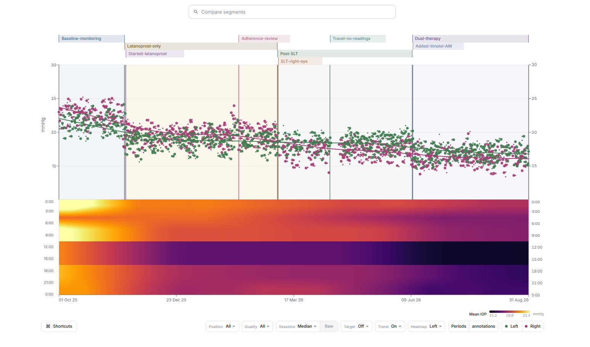
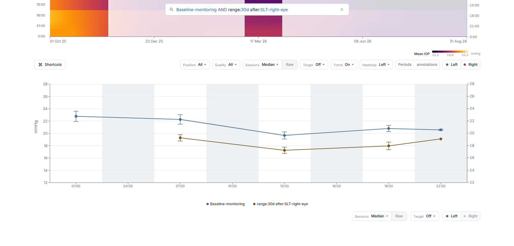

<div align="center">
  <a href="https://whatismyiop.com">
    
  </a>
  <p>
    <a href="https://whatismyiop.com"></a>
    <a href="https://github.com/jakubg05/whatismyiop/actions/workflows/ci.yml"></a>
  </p>
</div>

WhatIsMyIOP turns iCare HOME2 CSV exports into charts for reviewing home eye-pressure measurements. It shows measurements over time, time-of-day patterns, treatment periods, annotations, and comparisons between selected parts of the history.

<p align="center">
  
</p>

## What it does

- Shows raw readings or groups nearby readings into measurement sessions
- Calculates averages, medians, and trends for the left and right eye
- Displays measurements by date and time of day
- Adds treatment periods and annotations to the measurement history
- Compares selected periods side by side
- Saves editable `.whatismyiop` reports with their chart context

<p align="center">
  
</p>

## Data and privacy

The app parses imported files in the browser and does not upload measurements to an application server. It stores the active workspace in that browser so it remains available after a refresh. The original CSV text is discarded after parsing. Users can clear the stored copy or export an editable report.

Do not attach real patient exports, reports, or identifiable screenshots to public issues.

## Run locally

```sh
npm ci
npm run dev
```

The [development guide](docs/development.md) covers prerequisites, tests, production builds, project structure, synthetic demo data, and Cloudflare previews.

## Contributing

Bug reports and pull requests are welcome. Read [CONTRIBUTING.md](CONTRIBUTING.md) before starting a larger change.

## Medical scope

WhatIsMyIOP is a charting tool, not a medical device. It does not diagnose an eye condition, determine whether a pressure is safe, or recommend treatment.

WhatIsMyIOP is independent and is not affiliated with or endorsed by the manufacturer of iCare HOME2.
